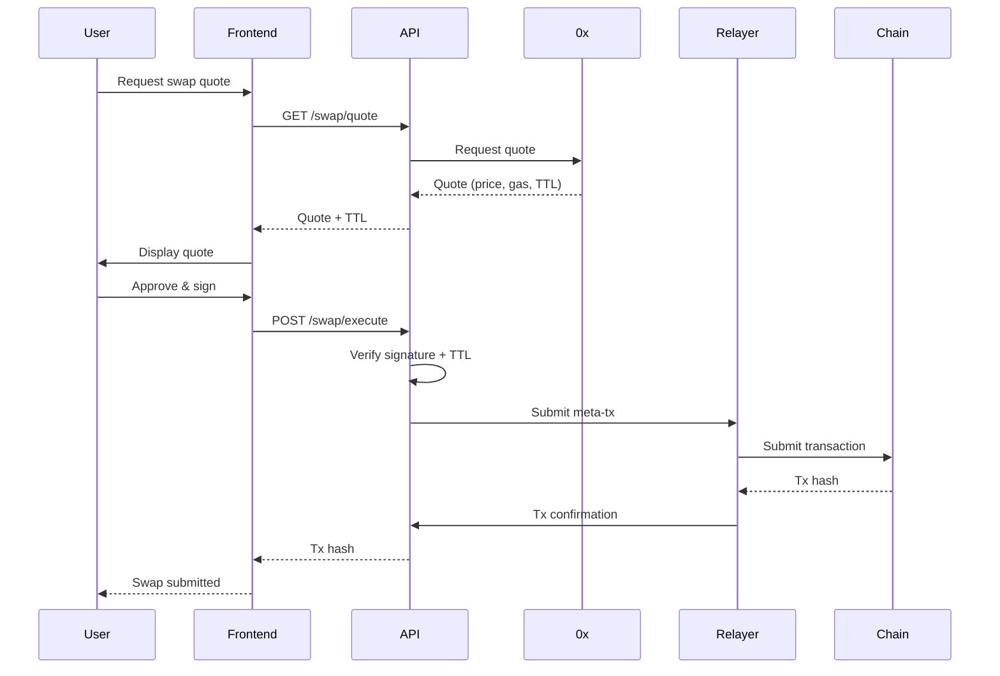
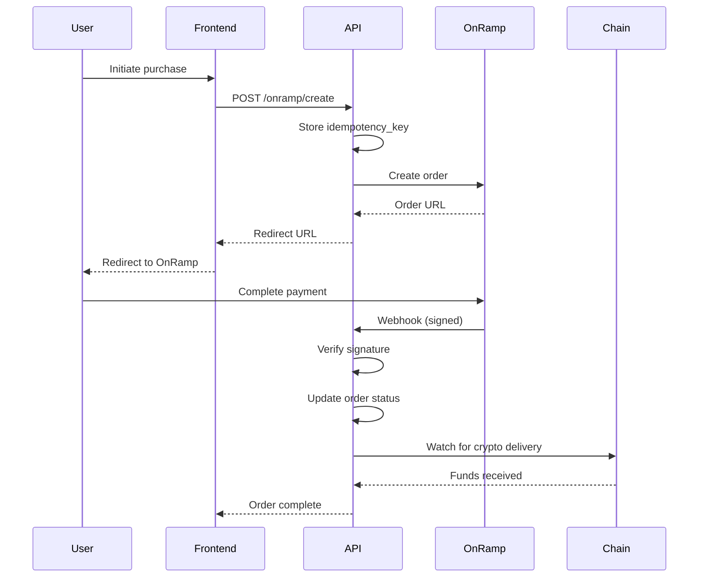

# NebulAX Exchange - System Design & Security

**Version:** 1.0
**Last Updated:** 2025-11-18
**Status:** Production Guidelines

---

## Table of Contents

1. [Overview](#overview)
2. [Architectural Implications](#architectural-implications)
3. [Integration & Message Flows](#integration--message-flows)
4. [Failure Modes & Fallbacks](#failure-modes--fallbacks)
5. [Security & Correctness](#security--correctness)
6. [Operational Excellence](#operational-excellence)
7. [Implementation Checklist](#implementation-checklist)

---

## Overview

This document provides **concrete implementation guidance** for building a secure, resilient, non-custodial cryptocurrency exchange. It covers:

- **System architecture implications** of key technology choices
- **Message flows** for trading, swaps, and fiat on-ramp
- **Failure modes** and mitigation strategies
- **Security patterns** for non-custodial operations
- **Operational requirements** for production readiness

**Critical Design Principles:**
- ✅ Non-custodial (users control their keys)
- ✅ Event-driven architecture with reconciliation
- ✅ Idempotent operations
- ✅ Defense-in-depth security
- ✅ Observable and alertable

---

## Architectural Implications

### 1. Non-Custodial + Wallet Authentication

#### Benefits

**Regulatory Advantages:**
- ✅ Reduced regulatory burden (no custody license required)
- ✅ Drastically lower attack surface (you don't hold user funds)
- ✅ Users maintain sovereignty over their assets

**User Experience:**
- ✅ No deposit/withdrawal flow complexity
- ✅ Direct blockchain interaction
- ✅ Transparent fund management

#### Requirements

```typescript
// SIWE (Sign-In With Ethereum) - EIP-4361
import { SiweMessage } from 'siwe';

// Server-side: Generate nonce for user
export async function generateAuthNonce(walletAddress: string): Promise<string> {
  const nonce = generateSecureNonce(); // crypto.randomBytes(32).toString('hex')

  await db.insert(authNonces).values({
    walletAddress: walletAddress.toLowerCase(),
    nonce,
    expiresAt: new Date(Date.now() + 5 * 60 * 1000), // 5 minutes
  });

  return nonce;
}

// Verify signed message
export async function verifySignature(
  message: string,
  signature: string,
  walletAddress: string
): Promise<boolean> {
  try {
    const siweMessage = new SiweMessage(message);
    const fields = await siweMessage.verify({ signature });

    // Verify nonce hasn't been used
    const nonceValid = await db.select()
      .from(authNonces)
      .where(
        and(
          eq(authNonces.walletAddress, walletAddress.toLowerCase()),
          eq(authNonces.nonce, siweMessage.nonce),
          gt(authNonces.expiresAt, new Date()),
          eq(authNonces.used, false)
        )
      );

    if (!nonceValid.length) return false;

    // Mark nonce as used
    await db.update(authNonces)
      .set({ used: true })
      .where(eq(authNonces.nonce, siweMessage.nonce));

    return fields.data.address.toLowerCase() === walletAddress.toLowerCase();
  } catch (error) {
    console.error('Signature verification failed:', error);
    return false;
  }
}

// Create session after successful verification
export async function createSession(walletAddress: string): Promise<string> {
  const sessionToken = generateSecureToken();

  await db.insert(sessions).values({
    token: sessionToken,
    walletAddress: walletAddress.toLowerCase(),
    expiresAt: new Date(Date.now() + 7 * 24 * 60 * 60 * 1000), // 7 days
  });

  return sessionToken;
}
```

**UX Requirements:**
- 🔴 **Critical:** Clear messaging about gas costs and approvals
- 🔴 **Critical:** User education on wallet permissions
- 🔴 **Critical:** Signing flow must be intuitive (no scary technical messages)

**Operational Security:**
```typescript
// Relayer keys must be protected
// Use KMS/HSM/MPC for operational signing keys

import { KMSClient, SignCommand } from '@aws-sdk/client-kms';

class RelayerKeyManager {
  private kms: KMSClient;
  private keyId: string;

  constructor() {
    this.kms = new KMSClient({ region: process.env.AWS_REGION });
    this.keyId = process.env.KMS_RELAYER_KEY_ID!;
  }

  async signTransaction(messageHash: Buffer): Promise<string> {
    const command = new SignCommand({
      KeyId: this.keyId,
      Message: messageHash,
      MessageType: 'DIGEST',
      SigningAlgorithm: 'ECDSA_SHA_256',
    });

    const response = await this.kms.send(command);
    return Buffer.from(response.Signature!).toString('hex');
  }
}
```

---

### 2. Hyperliquid for Orderbook/Execution

#### Benefits

- ✅ Avoid building/operating a CLOB/matching engine
- ✅ Get market depth & execution capabilities faster
- ✅ Reduced infrastructure complexity

#### Tradeoffs & Mitigation

**Dependency Risk:**
```typescript
// Circuit breaker pattern for Hyperliquid API
class HyperliquidCircuitBreaker {
  private failureCount = 0;
  private lastFailureTime = 0;
  private readonly threshold = 5;
  private readonly timeout = 60000; // 1 minute

  async execute<T>(operation: () => Promise<T>): Promise<T> {
    // Check if circuit is open
    if (this.isOpen()) {
      throw new Error('Hyperliquid circuit breaker is OPEN - service degraded');
    }

    try {
      const result = await operation();
      this.onSuccess();
      return result;
    } catch (error) {
      this.onFailure();
      throw error;
    }
  }

  private isOpen(): boolean {
    if (this.failureCount >= this.threshold) {
      const timeSinceLastFailure = Date.now() - this.lastFailureTime;
      if (timeSinceLastFailure < this.timeout) {
        return true;
      }
      // Half-open: reset and try again
      this.reset();
    }
    return false;
  }

  private onSuccess() {
    this.reset();
  }

  private onFailure() {
    this.failureCount++;
    this.lastFailureTime = Date.now();
  }

  private reset() {
    this.failureCount = 0;
  }
}

// Fallback routing strategy
class OrderRouter {
  private hyperliquidBreaker = new HyperliquidCircuitBreaker();

  async placeOrder(order: Order): Promise<ExecutionResult> {
    try {
      // Primary: Hyperliquid
      return await this.hyperliquidBreaker.execute(() =>
        this.executeOnHyperliquid(order)
      );
    } catch (error) {
      // Fallback: Route to DEX aggregator (0x)
      console.warn('Hyperliquid unavailable, routing to 0x Protocol');
      return await this.executeOn0x(order);
    }
  }
}
```

**Reconciliation Pattern:**
```typescript
// Reconcile DB ledger ↔ Hyperliquid order IDs ↔ on-chain fills
interface OrderReconciliation {
  internalOrderId: string;
  providerOrderId: string;
  providerStatus: string;
  chainTxHash?: string;
  chainConfirmations: number;
  reconciledAt?: Date;
}

class OrderReconciler {
  async reconcile(orderId: string): Promise<void> {
    const dbOrder = await this.getDbOrder(orderId);
    const hlOrder = await this.getHyperliquidOrder(dbOrder.providerOrderId);
    const chainTx = await this.getChainTransaction(hlOrder.txHash);

    // Check for discrepancies
    if (dbOrder.status !== this.mapStatus(hlOrder.status)) {
      await this.logDiscrepancy({
        orderId,
        dbStatus: dbOrder.status,
        hlStatus: hlOrder.status,
        severity: 'HIGH',
      });

      // Update DB to match provider (source of truth)
      await this.updateOrderStatus(orderId, hlOrder.status);
    }

    // Verify on-chain confirmation
    if (chainTx && chainTx.confirmations >= 12) {
      await this.markOrderFinalized(orderId);
    }
  }

  // Run every minute
  async runContinuousReconciliation(): Promise<void> {
    const pendingOrders = await this.getPendingOrders();

    for (const order of pendingOrders) {
      try {
        await this.reconcile(order.id);
      } catch (error) {
        console.error(`Reconciliation failed for order ${order.id}:`, error);
      }
    }
  }
}
```

**Latency & Determinism:**
- ⚠️ Account for Hyperliquid API latency (50-200ms typical)
- ⚠️ No atomic on-chain settlement guarantee
- ✅ Design for idempotency at every step
- ✅ Implement retry logic with exponential backoff

---

### 3. 0x Protocol for Swaps

#### Benefits

- ✅ Mature DEX aggregator with optimized routing
- ✅ Access to deep liquidity across multiple DEXes
- ✅ Gas optimization and smart order routing

#### Requirements

```typescript
// Quote handling with TTL and slippage protection
interface SwapQuote {
  sellToken: string;
  buyToken: string;
  sellAmount: string;
  buyAmount: string;
  price: string;
  guaranteedPrice: string;
  to: string;
  data: string;
  value: string;
  gas: string;
  gasPrice: string;
  quoteExpiry: number; // Unix timestamp
  allowanceTarget: string;
}

class ZeroXSwapService {
  private readonly maxSlippage = 0.01; // 1%

  async getQuote(params: SwapParams): Promise<SwapQuote> {
    const quote = await fetch(
      `https://api.0x.org/swap/v1/quote?${new URLSearchParams({
        sellToken: params.sellToken,
        buyToken: params.buyToken,
        sellAmount: params.sellAmount,
        slippagePercentage: this.maxSlippage.toString(),
        takerAddress: params.userAddress,
      })}`,
      {
        headers: {
          '0x-api-key': process.env.ZERO_X_API_KEY!,
        },
      }
    );

    const data = await quote.json();

    // Store quote with TTL for verification
    await this.storeQuote({
      quoteId: generateQuoteId(),
      userId: params.userId,
      quote: data,
      expiresAt: new Date(data.quoteExpiry * 1000),
    });

    return data;
  }

  async executeSwap(quoteId: string, signature: string): Promise<string> {
    const quote = await this.getStoredQuote(quoteId);

    // Verify quote is still valid
    if (Date.now() > quote.expiresAt.getTime()) {
      throw new Error('Quote expired - please refresh');
    }

    // Verify user signature (meta-tx or direct)
    const isValid = await this.verifySwapSignature(quote, signature);
    if (!isValid) {
      throw new Error('Invalid signature');
    }

    // Check approval status on-chain before submission
    const allowance = await this.checkAllowance(
      quote.sellToken,
      quote.user,
      quote.allowanceTarget
    );

    if (BigInt(allowance) < BigInt(quote.sellAmount)) {
      throw new Error('Insufficient allowance - please approve token first');
    }

    // Submit to relayer or user submits directly
    if (quote.gasless) {
      return await this.submitViaRelayer(quote);
    } else {
      // Return unsigned tx for user to sign
      return quote.data;
    }
  }

  // Private relayer submission (anti-MEV)
  async submitViaRelayer(quote: SwapQuote): Promise<string> {
    // Use Flashbots or private mempool for high-value swaps
    const threshold = ethers.parseEther('10000'); // $10k+

    if (BigInt(quote.value) > threshold) {
      return await this.submitToFlashbots(quote);
    }

    // Standard relayer submission
    const relayerWallet = this.getRelayerWallet();
    const tx = await relayerWallet.sendTransaction({
      to: quote.to,
      data: quote.data,
      value: quote.value,
      gasLimit: quote.gas,
      gasPrice: quote.gasPrice,
    });

    // Store nonce to prevent replay
    await this.storeUsedNonce(tx.nonce);

    return tx.hash;
  }
}
```

**EIP-2612 Permit (Gasless Approvals):**
```typescript
// Use permit to avoid separate approve transaction
async function swapWithPermit(
  token: string,
  amount: string,
  deadline: number,
  v: number,
  r: string,
  s: string
) {
  // Token must support EIP-2612
  const tokenContract = new ethers.Contract(token, ERC20_PERMIT_ABI, provider);

  // Call permit before swap (single tx)
  await tokenContract.permit(
    userAddress,
    spenderAddress,
    amount,
    deadline,
    v,
    r,
    s
  );

  // Now execute swap
}
```

**Front-Running Protection:**
- ✅ Use private relayer (Flashbots) for high-value swaps
- ✅ Minimize cleartext order exposure
- ✅ Shorten quote TTLs (30-60 seconds)
- ✅ Use guaranteed price (not best-case price)

---

### 4. OnRamp Money for Fiat On-Ramp

#### Benefits

- ✅ Fully hosted fiat rails (no banking integration needed)
- ✅ KYC/AML compliance offloaded to provider
- ✅ Multi-currency and payment method support

#### Requirements

```typescript
// Webhook signature verification (CRITICAL)
import crypto from 'crypto';

function verifyOnRampWebhook(payload: string, signature: string): boolean {
  const expectedSignature = crypto
    .createHmac('sha512', process.env.ONRAMP_API_KEY!)
    .update(payload)
    .digest('hex')
    .toUpperCase();

  return crypto.timingSafeEqual(
    Buffer.from(expectedSignature),
    Buffer.from(signature)
  );
}

// Idempotent order handling
class OnRampService {
  async createOrder(params: OnRampParams): Promise<OnRampOrder> {
    const idempotencyKey = `${params.userId}-${params.amount}-${Date.now()}`;

    // Check if order already exists
    const existing = await db.select()
      .from(onrampOrders)
      .where(eq(onrampOrders.idempotencyKey, idempotencyKey))
      .limit(1);

    if (existing.length > 0) {
      return existing[0]; // Return existing order
    }

    // Create new order
    const order = await db.insert(onrampOrders).values({
      idempotencyKey,
      userId: params.userId,
      fiatAmount: params.amount,
      fiatCurrency: params.currency,
      cryptoCurrency: params.crypto,
      status: 'pending',
      callbackUrl: `${process.env.API_URL}/webhooks/onramp`,
    }).returning();

    // Emit event
    await eventBus.emit('onramp.order.created', order[0]);

    return order[0];
  }

  async handleWebhook(payload: string, signature: string): Promise<void> {
    // CRITICAL: Verify signature first
    if (!verifyOnRampWebhook(payload, signature)) {
      throw new Error('Invalid webhook signature');
    }

    const data = JSON.parse(payload);

    // Idempotent update
    await db.update(onrampOrders)
      .set({
        providerOrderId: data.orderId,
        status: this.mapStatus(data.status),
        cryptoAmount: data.cryptoAmount,
        updatedAt: new Date(),
      })
      .where(eq(onrampOrders.idempotencyKey, data.merchantRecognitionId));

    // Emit event for downstream processing
    await eventBus.emit('onramp.status.updated', {
      orderId: data.merchantRecognitionId,
      status: data.status,
    });
  }

  // Reconciliation: Poll provider if webhook not received
  async reconcileOrder(orderId: string): Promise<void> {
    const order = await this.getOrder(orderId);

    // If no update in 5 minutes, poll provider
    const staleThreshold = 5 * 60 * 1000;
    const timeSinceUpdate = Date.now() - order.updatedAt.getTime();

    if (timeSinceUpdate > staleThreshold && order.status === 'pending') {
      const providerStatus = await this.pollProviderStatus(order.providerOrderId);

      if (providerStatus !== order.status) {
        await this.updateOrderStatus(orderId, providerStatus);
      }
    }
  }
}
```

**KYC Status Tracking:**
```typescript
// Store KYC status for AML compliance
interface UserKYC {
  userId: string;
  kycLevel: number; // 0 = none, 1 = basic, 2 = enhanced
  kycProvider: string;
  kycVerifiedAt?: Date;
  kycExpiresAt?: Date;
  monthlyLimit: number;
  yearlyLimit: number;
  currentMonthVolume: number;
  currentYearVolume: number;
}

async function checkKYCLimits(userId: string, amount: number): Promise<boolean> {
  const kyc = await getUserKYC(userId);

  if (kyc.currentMonthVolume + amount > kyc.monthlyLimit) {
    throw new Error('Monthly KYC limit exceeded');
  }

  if (kyc.currentYearVolume + amount > kyc.yearlyLimit) {
    throw new Error('Yearly KYC limit exceeded');
  }

  return true;
}
```

---

## Integration & Message Flows

### Overall Trading Flow (Concrete)

```typescript
// Event-driven architecture with message bus
interface EventBus {
  emit(event: string, data: any): Promise<void>;
  subscribe(event: string, handler: (data: any) => Promise<void>): void;
}

// Flow: User places a trade
async function placeTradeFlow(req: Request, res: Response) {
  // 1. Frontend triggers order creation
  const { symbol, side, type, amount, price } = req.body;

  // 2. Auth service verifies wallet via SIWE
  const user = await verifyAuth(req.headers.authorization);
  if (!user) {
    return res.status(401).json({ error: 'Unauthorized' });
  }

  // 3. Create canonical order (append-only)
  const order = await db.insert(orders).values({
    userId: user.id,
    symbol,
    side,
    type,
    amount,
    price,
    status: 'pending',
    nonce: await getNextNonce(user.id),
  }).returning();

  // 4. Emit event to message bus
  await eventBus.emit('orders.created', {
    orderId: order[0].id,
    userId: user.id,
    symbol,
    side,
    amount,
    price,
  });

  res.status(201).json({ order: order[0] });
}

// Order service handler
eventBus.subscribe('orders.created', async (data) => {
  const { orderId, symbol, side, amount, price } = data;

  try {
    // 5. Route to Hyperliquid via their API
    const hlResponse = await hyperliquid.placeOrder({
      coin: symbol,
      isBuy: side === 'buy',
      px: price,
      sz: amount,
      orderType: { limit: { tif: 'Gtc' } },
    });

    // 6. Store provider order ID
    await db.update(orders)
      .set({
        providerOrderId: hlResponse.orderId,
        providerStatus: hlResponse.status,
        signedRequest: JSON.stringify(hlResponse.request),
        quoteHash: hlResponse.quoteHash,
        updatedAt: new Date(),
      })
      .where(eq(orders.id, orderId));

    // 7. On success, emit fills.created
    if (hlResponse.status === 'filled') {
      await eventBus.emit('fills.created', {
        orderId,
        fillPrice: hlResponse.fillPrice,
        fillAmount: hlResponse.fillAmount,
        txHash: hlResponse.txHash,
      });

      // 8. Write ledger entry
      await db.insert(ledgerEntries).values({
        userId: data.userId,
        type: 'trade',
        asset: symbol,
        amount: side === 'buy' ? amount : -amount,
        price: hlResponse.fillPrice,
        orderId,
      });
    }
  } catch (error) {
    console.error('Order placement failed:', error);

    // Update order status to failed
    await db.update(orders)
      .set({ status: 'failed', error: error.message })
      .where(eq(orders.id, orderId));
  }
});

// Blockchain watcher
class BlockchainWatcher {
  async watchTransaction(txHash: string, orderId: string) {
    const receipt = await provider.waitForTransaction(txHash, 12); // 12 confirmations

    if (receipt.status === 1) {
      // Emit confirmation event
      await eventBus.emit('chain.tx.confirmed', {
        txHash,
        orderId,
        confirmations: 12,
        blockNumber: receipt.blockNumber,
      });
    }
  }
}

// Reconciler matches events
eventBus.subscribe('chain.tx.confirmed', async (data) => {
  const { orderId, txHash } = data;

  // Update order status to finalized
  await db.update(orders)
    .set({
      status: 'finalized',
      chainTxHash: txHash,
      finalizedAt: new Date(),
    })
    .where(eq(orders.id, orderId));

  // Mark as reconciled
  await db.insert(reconciliations).values({
    orderId,
    dbStatus: 'finalized',
    providerStatus: 'settled',
    chainStatus: 'confirmed',
    reconciledAt: new Date(),
  });
});
```

### Swap Flow (0x Protocol)



### OnRamp Flow (Fiat-to-Crypto)



---

## Failure Modes & Fallbacks

### 1. Hyperliquid API Down / Rate-Limited

**Symptoms:**
- API returns 503 Service Unavailable
- Requests timeout after 30 seconds
- Rate limit errors (429 Too Many Requests)

**Mitigation:**

```typescript
class OrderExecutionService {
  private hyperliquidBreaker = new CircuitBreaker({ threshold: 5, timeout: 60000 });

  async executeOrder(order: Order): Promise<ExecutionResult> {
    try {
      // Primary: Hyperliquid
      return await this.hyperliquidBreaker.execute(() =>
        this.executeOnHyperliquid(order)
      );
    } catch (error) {
      if (this.hyperliquidBreaker.isOpen()) {
        // Degrade to read-only mode
        await this.enableReadOnlyMode();

        // Show stale orderbook snapshot
        const snapshot = await this.getOrderbookSnapshot(order.symbol);
        throw new ServiceDegradedError('Trading temporarily unavailable', snapshot);
      }

      // Fallback: Route to 0x for market orders
      if (order.type === 'market') {
        console.warn('Routing market order to 0x due to Hyperliquid unavailability');
        return await this.executeOn0x(order);
      }

      throw error;
    }
  }

  async enableReadOnlyMode(): Promise<void> {
    // Update system status
    await redis.set('system:status', 'read-only', 'EX', 300); // 5 minutes

    // Alert operations team
    await this.sendAlert({
      severity: 'HIGH',
      message: 'Hyperliquid circuit breaker OPEN - read-only mode enabled',
      timestamp: new Date(),
    });
  }
}
```

**Backoff Strategy:**

```typescript
async function executeWithBackoff<T>(
  operation: () => Promise<T>,
  maxRetries = 5
): Promise<T> {
  for (let i = 0; i < maxRetries; i++) {
    try {
      return await operation();
    } catch (error) {
      if (i === maxRetries - 1) throw error;

      const delay = Math.min(1000 * Math.pow(2, i), 30000); // Max 30s
      console.log(`Retry ${i + 1}/${maxRetries} after ${delay}ms`);
      await sleep(delay);
    }
  }

  throw new Error('Max retries exceeded');
}
```

---

### 2. Quote Mismatch / Stale Quote

**Problem:**
- Price moves between quote request and execution
- Quote TTL expires
- Slippage exceeds user tolerance

**Solution:**

```typescript
class QuoteValidator {
  async validateQuote(quoteId: string): Promise<boolean> {
    const storedQuote = await this.getStoredQuote(quoteId);

    // Check TTL
    if (Date.now() > storedQuote.expiresAt.getTime()) {
      throw new QuoteExpiredError('Quote expired - refresh required');
    }

    // Server-side simulation before submission
    const currentQuote = await this.get0xQuote(storedQuote.params);

    // Check price deviation
    const deviation = this.calculateDeviation(
      storedQuote.price,
      currentQuote.price
    );

    if (deviation > 0.02) { // 2% deviation threshold
      throw new QuoteMismatchError(
        `Price moved ${(deviation * 100).toFixed(2)}% - please refresh`,
        { old: storedQuote.price, new: currentQuote.price }
      );
    }

    // Simulate on-chain execution
    try {
      await this.simulateTransaction(currentQuote);
    } catch (error) {
      throw new SimulationFailedError('Transaction would revert', error);
    }

    return true;
  }

  private calculateDeviation(oldPrice: string, newPrice: string): number {
    const old = parseFloat(oldPrice);
    const current = parseFloat(newPrice);
    return Math.abs((current - old) / old);
  }
}
```

---

### 3. Webhook Misfire / Provider Inconsistency

**Problem:**
- Webhook not received (network issue, provider bug)
- Webhook delivered out of order
- Duplicate webhooks

**Solution:**

```typescript
class WebhookHandler {
  // Idempotent webhook processing
  async handleWebhook(req: Request, res: Response): Promise<void> {
    const signature = req.headers['x-webhook-signature'] as string;
    const payload = JSON.stringify(req.body);

    // 1. Verify signature (CRITICAL)
    if (!this.verifySignature(payload, signature)) {
      return res.status(403).json({ error: 'Invalid signature' });
    }

    // 2. Check idempotency key
    const idempotencyKey = req.body.idempotency_key || req.body.event_id;
    const existing = await redis.get(`webhook:${idempotencyKey}`);

    if (existing) {
      // Webhook already processed
      return res.status(200).json({ status: 'already_processed' });
    }

    // 3. Process webhook
    try {
      await this.processWebhook(req.body);

      // 4. Mark as processed (24h TTL)
      await redis.set(`webhook:${idempotencyKey}`, '1', 'EX', 86400);

      res.status(200).json({ status: 'success' });
    } catch (error) {
      console.error('Webhook processing failed:', error);

      // Return 500 so provider retries
      res.status(500).json({ error: 'Processing failed' });
    }
  }

  // Reconciliation: Poll provider if webhook not received
  async reconcileWebhooks(): Promise<void> {
    // Find orders pending for > 5 minutes
    const staleOrders = await db.select()
      .from(onrampOrders)
      .where(
        and(
          eq(onrampOrders.status, 'pending'),
          lt(onrampOrders.updatedAt, new Date(Date.now() - 5 * 60 * 1000))
        )
      );

    for (const order of staleOrders) {
      try {
        // Poll provider API
        const providerStatus = await this.pollProvider(order.providerOrderId);

        if (providerStatus !== order.status) {
          console.warn(`Status mismatch for order ${order.id}: DB=${order.status}, Provider=${providerStatus}`);

          // Update status
          await this.updateOrderStatus(order.id, providerStatus);
        }
      } catch (error) {
        console.error(`Failed to reconcile order ${order.id}:`, error);
      }
    }
  }
}
```

**Reconciliation Job (Run every minute):**

```typescript
import cron from 'node-cron';

// Run reconciliation every minute
cron.schedule('* * * * *', async () => {
  try {
    await webhookHandler.reconcileWebhooks();
  } catch (error) {
    console.error('Reconciliation job failed:', error);
  }
});
```

---

### 4. Relayer Key Compromise

**Prevention:**

```typescript
// Hot wallet limits
const HOT_WALLET_LIMITS = {
  maxBalance: ethers.parseEther('10'), // 10 ETH max
  dailyTransferCap: ethers.parseEther('50'), // 50 ETH/day
  perTxLimit: ethers.parseEther('5'), // 5 ETH per tx
};

class RelayerSecurityManager {
  async checkLimits(amount: bigint): Promise<void> {
    // Check per-tx limit
    if (amount > HOT_WALLET_LIMITS.perTxLimit) {
      throw new Error('Transaction exceeds per-tx limit - requires multisig');
    }

    // Check daily volume
    const dailyVolume = await this.getDailyVolume();
    if (dailyVolume + amount > HOT_WALLET_LIMITS.dailyTransferCap) {
      await this.alertOps('Daily transfer cap exceeded');
      throw new Error('Daily cap exceeded');
    }

    // Check hot wallet balance
    const balance = await this.getHotWalletBalance();
    if (balance > HOT_WALLET_LIMITS.maxBalance) {
      await this.triggerRebalance();
    }
  }

  async triggerRebalance(): Promise<void> {
    // Move excess funds to cold multisig
    const excess = await this.getHotWalletBalance() - HOT_WALLET_LIMITS.maxBalance;

    if (excess > 0) {
      await this.requestMultisigTransfer({
        to: process.env.COLD_WALLET_ADDRESS!,
        amount: excess,
        reason: 'Hot wallet rebalance',
      });
    }
  }

  async monitorAnomalousActivity(): Promise<void> {
    // Alert on unusual patterns
    const recentTxs = await this.getRecentTransactions(100);

    const patterns = {
      outOfHours: this.detectOutOfHoursActivity(recentTxs),
      highFrequency: this.detectHighFrequency(recentTxs),
      unusualDestinations: this.detectUnusualDestinations(recentTxs),
    };

    if (patterns.outOfHours || patterns.highFrequency || patterns.unusualDestinations) {
      await this.alertSecurity({
        severity: 'CRITICAL',
        patterns,
        message: 'Anomalous relayer activity detected',
      });

      // Auto-pause relayer if high severity
      await this.pauseRelayer();
    }
  }
}
```

**Multisig for Large Rebalances:**

```typescript
// Use Safe (Gnosis Safe) for cold storage
import Safe from '@safe-global/protocol-kit';

async function createMultisigTransfer(params: {
  to: string;
  amount: bigint;
  reason: string;
}): Promise<string> {
  const safe = await Safe.create({
    ethAdapter,
    safeAddress: process.env.MULTISIG_ADDRESS!,
  });

  const transaction = {
    to: params.to,
    value: params.amount.toString(),
    data: '0x',
  };

  const safeTransaction = await safe.createTransaction({ transactions: [transaction] });
  const txHash = await safe.getTransactionHash(safeTransaction);

  // Store for signing
  await db.insert(multisigTxs).values({
    txHash,
    to: params.to,
    amount: params.amount.toString(),
    reason: params.reason,
    status: 'pending',
    requiredSignatures: 3,
  });

  return txHash;
}
```

---

### 5. Front-Running / MEV

**Mitigation:**

```typescript
class MEVProtection {
  async submitSwap(swap: SwapTransaction): Promise<string> {
    const estimatedValue = this.estimateTransactionValue(swap);

    // Use Flashbots for high-value swaps
    if (estimatedValue > 10000) { // > $10k
      return await this.submitToFlashbots(swap);
    }

    // Use private mempool
    return await this.submitToPrivatePool(swap);
  }

  private async submitToFlashbots(swap: SwapTransaction): Promise<string> {
    const flashbotsProvider = await FlashbotsBundleProvider.create(
      provider,
      authSigner,
      'https://relay.flashbots.net',
      'mainnet'
    );

    const bundle = [
      {
        signer: relayerWallet,
        transaction: {
          to: swap.to,
          data: swap.data,
          value: swap.value,
          gasLimit: swap.gasLimit,
        },
      },
    ];

    const signedBundle = await flashbotsProvider.signBundle(bundle);
    const simulation = await flashbotsProvider.simulate(signedBundle, 'latest');

    if ('error' in simulation) {
      throw new Error(`Simulation failed: ${simulation.error.message}`);
    }

    const submission = await flashbotsProvider.sendRawBundle(
      signedBundle,
      await provider.getBlockNumber() + 1
    );

    return submission.bundleHash;
  }
}
```

---

### 6. DB and Chain Diverge

**Continuous Reconciliation:**

```typescript
class ChainReconciler {
  async reconcile(): Promise<void> {
    // Get recent blocks
    const latestBlock = await provider.getBlockNumber();
    const lastReconciledBlock = await this.getLastReconciledBlock();

    for (let block = lastReconciledBlock + 1; block <= latestBlock; block++) {
      await this.reconcileBlock(block);
    }
  }

  async reconcileBlock(blockNumber: number): Promise<void> {
    const block = await provider.getBlock(blockNumber, true);

    for (const tx of block.transactions) {
      // Check if this is our transaction
      const dbTx = await db.select()
        .from(transactions)
        .where(eq(transactions.chainTxHash, tx.hash))
        .limit(1);

      if (dbTx.length === 0) continue;

      // Verify status matches
      const receipt = await provider.getTransactionReceipt(tx.hash);
      const expectedStatus = receipt.status === 1 ? 'success' : 'failed';

      if (dbTx[0].status !== expectedStatus) {
        await this.logDiscrepancy({
          txHash: tx.hash,
          dbStatus: dbTx[0].status,
          chainStatus: expectedStatus,
          blockNumber,
          severity: 'HIGH',
        });

        // Update DB to match chain (source of truth)
        await db.update(transactions)
          .set({ status: expectedStatus, reconciledAt: new Date() })
          .where(eq(transactions.chainTxHash, tx.hash));
      }
    }

    await this.setLastReconciledBlock(blockNumber);
  }

  async checkDiscrepancyThreshold(): Promise<void> {
    const discrepancies = await db.select()
      .from(reconciliationLogs)
      .where(
        and(
          eq(reconciliationLogs.severity, 'HIGH'),
          gt(reconciliationLogs.createdAt, new Date(Date.now() - 60 * 60 * 1000)) // Last hour
        )
      );

    // Calculate total value of discrepancies
    const totalValue = discrepancies.reduce((sum, d) => sum + (d.value || 0), 0);

    if (totalValue > 1000) { // $1000 threshold
      await this.alertCritical({
        message: `Reconciliation discrepancy: $${totalValue}`,
        count: discrepancies.length,
        severity: 'CRITICAL',
      });
    }
  }
}

// Run every minute
setInterval(async () => {
  await chainReconciler.reconcile();
  await chainReconciler.checkDiscrepancyThreshold();
}, 60 * 1000);
```

---

## Security & Correctness

### 1. Auth & Session (SIWE)

```typescript
// Sign-In With Ethereum (EIP-4361)
import { SiweMessage } from 'siwe';

export class AuthService {
  async generateNonce(walletAddress: string): Promise<string> {
    const nonce = crypto.randomBytes(32).toString('hex');

    await db.insert(authNonces).values({
      walletAddress: walletAddress.toLowerCase(),
      nonce,
      expiresAt: new Date(Date.now() + 5 * 60 * 1000), // 5 min
      used: false,
    });

    return nonce;
  }

  async verifySignature(message: string, signature: string): Promise<User> {
    const siweMessage = new SiweMessage(message);
    const fields = await siweMessage.verify({ signature });

    // Verify nonce
    const nonce = await db.select()
      .from(authNonces)
      .where(
        and(
          eq(authNonces.nonce, siweMessage.nonce),
          eq(authNonces.used, false),
          gt(authNonces.expiresAt, new Date())
        )
      )
      .limit(1);

    if (!nonce.length) {
      throw new Error('Invalid or expired nonce');
    }

    // Mark nonce as used (prevent replay)
    await db.update(authNonces)
      .set({ used: true })
      .where(eq(authNonces.nonce, siweMessage.nonce));

    // Get or create user
    const walletAddress = fields.data.address.toLowerCase();
    let user = await this.getUserByWallet(walletAddress);

    if (!user) {
      user = await this.createUser(walletAddress);
    }

    // Create session
    const sessionToken = await this.createSession(user.id, walletAddress);

    return { ...user, sessionToken };
  }

  private async createSession(userId: string, walletAddress: string): Promise<string> {
    const token = crypto.randomBytes(32).toString('hex');

    await db.insert(sessions).values({
      token,
      userId,
      walletAddress: walletAddress.toLowerCase(),
      expiresAt: new Date(Date.now() + 7 * 24 * 60 * 60 * 1000), // 7 days
      lastActiveAt: new Date(),
    });

    return token;
  }

  // Map user → wallet (many-to-one)
  async linkWallet(userId: string, walletAddress: string): Promise<void> {
    await db.insert(userWallets).values({
      userId,
      walletAddress: walletAddress.toLowerCase(),
      isPrimary: false,
      linkedAt: new Date(),
    });
  }
}
```

### 2. Relayer Nonce & Replay Protection

```typescript
// Per-user nonces for meta-transactions
class NonceManager {
  async getNextNonce(userId: string): Promise<number> {
    const result = await db.select()
      .from(userNonces)
      .where(eq(userNonces.userId, userId))
      .limit(1);

    if (!result.length) {
      await db.insert(userNonces).values({
        userId,
        nonce: 0,
      });
      return 0;
    }

    // Increment nonce atomically
    await db.update(userNonces)
      .set({ nonce: result[0].nonce + 1 })
      .where(eq(userNonces.userId, userId));

    return result[0].nonce + 1;
  }

  async verifyNonce(userId: string, nonce: number): Promise<boolean> {
    const current = await db.select()
      .from(userNonces)
      .where(eq(userNonces.userId, userId))
      .limit(1);

    if (!current.length) return false;

    // Nonce must be exactly current + 1 (sequential)
    return nonce === current[0].nonce + 1;
  }

  async storeUsedNonce(userId: string, nonce: number, txHash: string): Promise<void> {
    await db.insert(usedNonces).values({
      userId,
      nonce,
      txHash,
      usedAt: new Date(),
    });
  }
}

// EIP-712 domain-separated signatures
import { TypedDataDomain, TypedDataField } from 'viem';

const DOMAIN: TypedDataDomain = {
  name: 'NebulAX Exchange',
  version: '1',
  chainId: parseInt(process.env.CHAIN_ID!),
  verifyingContract: process.env.RELAYER_CONTRACT_ADDRESS! as `0x${string}`,
};

const SWAP_TYPES: Record<string, TypedDataField[]> = {
  Swap: [
    { name: 'from', type: 'address' },
    { name: 'to', type: 'address' },
    { name: 'sellToken', type: 'address' },
    { name: 'buyToken', type: 'address' },
    { name: 'sellAmount', type: 'uint256' },
    { name: 'minBuyAmount', type: 'uint256' },
    { name: 'nonce', type: 'uint256' },
    { name: 'deadline', type: 'uint256' },
  ],
};

async function signSwap(wallet: WalletClient, swap: SwapParams): Promise<string> {
  return await wallet.signTypedData({
    domain: DOMAIN,
    types: SWAP_TYPES,
    primaryType: 'Swap',
    message: swap,
  });
}
```

### 3. Approvals & Allowance Management

```typescript
// Prefer EIP-2612 permit
async function checkPermitSupport(token: string): Promise<boolean> {
  try {
    const contract = new Contract(token, ERC20_PERMIT_ABI, provider);
    await contract.DOMAIN_SEPARATOR();
    return true;
  } catch {
    return false;
  }
}

async function getApprovalStrategy(token: string): Promise<'permit' | 'approve'> {
  const supportsPermit = await checkPermitSupport(token);
  return supportsPermit ? 'permit' : 'approve';
}

// Safe allowance amounts
class AllowanceManager {
  async getSafeAllowance(token: string, spender: string, amount: bigint): Promise<bigint> {
    // Never approve more than 2x the swap amount
    const safeAmount = amount * 2n;

    // Cap at 100 tokens max
    const maxTokens = ethers.parseUnits('100', await this.getDecimals(token));

    return safeAmount > maxTokens ? maxTokens : safeAmount;
  }

  async revokeAllowance(token: string, spender: string): Promise<void> {
    const contract = new Contract(token, ERC20_ABI, walletClient);
    await contract.approve(spender, 0);
  }

  // Warn users about unlimited approvals
  async checkAllowance(token: string, owner: string, spender: string): Promise<void> {
    const contract = new Contract(token, ERC20_ABI, provider);
    const allowance = await contract.allowance(owner, spender);

    const maxUint256 = 2n ** 256n - 1n;

    if (allowance === maxUint256) {
      console.warn(`Unlimited allowance detected for ${token} to ${spender}`);

      // Suggest revoke
      await this.suggestRevoke(token, spender);
    }
  }
}

// Server-side allowance verification
async function verifyAllowanceBeforeRelay(swap: SwapTransaction): Promise<void> {
  const allowance = await checkOnChainAllowance(
    swap.sellToken,
    swap.user,
    swap.allowanceTarget
  );

  if (BigInt(allowance) < BigInt(swap.sellAmount)) {
    throw new Error('Insufficient allowance - tx would revert');
  }
}
```

### 4. Key Management for Relayer

```typescript
// AWS KMS integration
import { KMSClient, SignCommand, GetPublicKeyCommand } from '@aws-sdk/client-kms';

class KMSKeyManager {
  private client: KMSClient;

  constructor() {
    this.client = new KMSClient({
      region: process.env.AWS_REGION!,
      credentials: {
        accessKeyId: process.env.AWS_ACCESS_KEY_ID!,
        secretAccessKey: process.env.AWS_SECRET_ACCESS_KEY!,
      },
    });
  }

  async sign(messageHash: Buffer): Promise<{ r: string; s: string; v: number }> {
    const command = new SignCommand({
      KeyId: process.env.KMS_KEY_ID!,
      Message: messageHash,
      MessageType: 'DIGEST',
      SigningAlgorithm: 'ECDSA_SHA_256',
    });

    const response = await this.client.send(command);
    const signature = this.parseSignature(response.Signature!);

    // Audit log
    await this.logKeyUse({
      keyId: process.env.KMS_KEY_ID!,
      operation: 'sign',
      messageHash: messageHash.toString('hex'),
      timestamp: new Date(),
    });

    return signature;
  }

  async rotateKey(): Promise<void> {
    // Create new key
    const newKeyId = await this.createNewKey();

    // Update environment variable
    await this.updateSecret('KMS_KEY_ID', newKeyId);

    // Disable old key after grace period
    setTimeout(() => {
      this.disableKey(process.env.KMS_KEY_ID!);
    }, 24 * 60 * 60 * 1000); // 24h grace period
  }
}

// Multisig for cold storage
class MultisigManager {
  async createMultisig(owners: string[], threshold: number): Promise<string> {
    // Deploy Safe (Gnosis Safe)
    const safeFactory = await ethers.getContractFactory('GnosisSafeProxyFactory');
    const safe = await safeFactory.deploy(owners, threshold);

    await db.insert(multisigs).values({
      address: safe.address,
      owners: JSON.stringify(owners),
      threshold,
      createdAt: new Date(),
    });

    return safe.address;
  }
}
```

---

## Operational Excellence

### 1. Rate Limiting & Fraud Controls

```typescript
// Rate limiting by wallet and IP
import rateLimit from 'express-rate-limit';
import RedisStore from 'rate-limit-redis';

const orderRateLimiter = rateLimit({
  store: new RedisStore({
    client: redis,
    prefix: 'rl:orders:',
  }),
  windowMs: 60 * 1000, // 1 minute
  max: 10, // 10 orders per minute
  keyGenerator: (req) => {
    // Rate limit by wallet address
    return req.user?.walletAddress || req.ip;
  },
  handler: (req, res) => {
    res.status(429).json({
      error: 'Too many orders - please slow down',
      retryAfter: 60,
    });
  },
});

app.post('/api/orders', authenticate, orderRateLimiter, placeOrderHandler);

// Fraud scoring for onramp orders
class FraudDetector {
  async scoreOrder(order: OnRampOrder): Promise<number> {
    let score = 0;

    // Velocity check
    const recentOrders = await this.getUserRecentOrders(order.userId, 24); // 24h
    if (recentOrders.length > 5) score += 20;
    if (recentOrders.length > 10) score += 30;

    // Amount check
    if (order.fiatAmount > 10000) score += 15;
    if (order.fiatAmount > 50000) score += 35;

    // IP geo anomaly
    const userCountry = await this.getUserCountry(order.userId);
    const ipCountry = await this.getIpCountry(order.ipAddress);
    if (userCountry !== ipCountry) score += 25;

    // First-time user
    const userAge = await this.getUserAge(order.userId);
    if (userAge < 24 * 60 * 60 * 1000) score += 20; // < 24h old

    // Total score
    return Math.min(score, 100);
  }

  async checkFraud(order: OnRampOrder): Promise<void> {
    const score = await this.scoreOrder(order);

    if (score > 80) {
      // Block order
      throw new FraudError('Order blocked - high fraud risk');
    } else if (score > 50) {
      // Manual review required
      await this.flagForReview(order.id, score);
    }

    // Log score
    await db.insert(fraudScores).values({
      orderId: order.id,
      score,
      factors: JSON.stringify(await this.getScoreFactors(order)),
      timestamp: new Date(),
    });
  }
}
```

### 2. Observability & Alerts

```typescript
// Prometheus metrics
import { Counter, Histogram, Gauge } from 'prom-client';

const orderCounter = new Counter({
  name: 'orders_total',
  help: 'Total number of orders',
  labelNames: ['status', 'symbol'],
});

const orderLatency = new Histogram({
  name: 'order_execution_duration_seconds',
  help: 'Order execution latency',
  buckets: [0.1, 0.5, 1, 2, 5, 10],
});

const relayerBalance = new Gauge({
  name: 'relayer_balance_eth',
  help: 'Current relayer hot wallet balance in ETH',
});

// Alert rules
class AlertManager {
  async checkMetrics(): Promise<void> {
    // High fill volume
    const fillVolume = await this.getFillVolume(60); // Last minute
    if (fillVolume > 1000000) { // $1M/min
      await this.alert({
        severity: 'HIGH',
        message: `Unusual fill volume: $${fillVolume}/min`,
      });
    }

    // Relayer key use out of hours
    const hour = new Date().getUTCHours();
    if (hour < 6 || hour > 22) { // 6am-10pm UTC
      const recentTxs = await this.getRelayerTransactions(5); // Last 5 min
      if (recentTxs.length > 0) {
        await this.alert({
          severity: 'CRITICAL',
          message: 'Relayer active outside business hours',
          transactions: recentTxs,
        });
      }
    }

    // Failed reconciliation
    const failedReconciliations = await this.getFailedReconciliations(60);
    if (failedReconciliations > 10) {
      await this.alert({
        severity: 'HIGH',
        message: `${failedReconciliations} reconciliation failures in last hour`,
      });
    }

    // High pending onramp orders
    const pendingOrders = await this.getPendingOnRampOrders();
    if (pendingOrders.length > 50) {
      await this.alert({
        severity: 'MEDIUM',
        message: `${pendingOrders.length} pending onramp orders`,
      });
    }
  }

  private async alert(params: AlertParams): Promise<void> {
    // Send to PagerDuty, Slack, email, etc.
    await this.sendToPagerDuty(params);
    await this.sendToSlack(params);

    // Store in DB
    await db.insert(alerts).values({
      severity: params.severity,
      message: params.message,
      metadata: JSON.stringify(params),
      sentAt: new Date(),
    });
  }
}

// Run every minute
setInterval(() => alertManager.checkMetrics(), 60 * 1000);
```

### 3. Blockchain Watcher with Confirmation Thresholds

```typescript
class BlockchainWatcher {
  private confirmationThresholds = {
    low: 1, // < $100
    medium: 6, // $100 - $10k
    high: 12, // > $10k
  };

  async watchTransaction(txHash: string, value: bigint): Promise<void> {
    const threshold = this.getConfirmationThreshold(value);

    console.log(`Watching ${txHash} - ${threshold} confirmations required`);

    // Wait for confirmations
    const receipt = await provider.waitForTransaction(txHash, threshold);

    if (receipt.status === 1) {
      await eventBus.emit('chain.tx.confirmed', {
        txHash,
        confirmations: threshold,
        blockNumber: receipt.blockNumber,
        value: value.toString(),
      });
    } else {
      await eventBus.emit('chain.tx.failed', {
        txHash,
        blockNumber: receipt.blockNumber,
        value: value.toString(),
      });
    }
  }

  private getConfirmationThreshold(value: bigint): number {
    const eth = ethers.formatEther(value);
    const usdValue = parseFloat(eth) * 3000; // Assume $3k ETH

    if (usdValue < 100) return this.confirmationThresholds.low;
    if (usdValue < 10000) return this.confirmationThresholds.medium;
    return this.confirmationThresholds.high;
  }

  async watchBlock(blockNumber: number): Promise<void> {
    const block = await provider.getBlock(blockNumber, true);

    for (const tx of block.transactions) {
      // Check if this is a transaction we care about
      if (await this.isRelevantTransaction(tx)) {
        await this.processTransaction(tx);
      }
    }
  }
}
```

---

## Implementation Checklist

### Phase 1: Authentication & Security Foundation

- [ ] Implement SIWE (EIP-4361) authentication
  - [ ] Nonce generation and storage
  - [ ] Signature verification
  - [ ] Session management
  - [ ] Multi-wallet support per user
- [ ] Set up KMS/HSM for relayer keys
  - [ ] AWS KMS integration
  - [ ] Key rotation policy
  - [ ] Audit logging
- [ ] Implement rate limiting
  - [ ] Per-wallet limits
  - [ ] Per-IP limits
  - [ ] Redis-backed rate limiter

### Phase 2: Order Execution & Routing

- [ ] Hyperliquid integration
  - [ ] API client with circuit breaker
  - [ ] Order placement flow
  - [ ] Status polling
  - [ ] Fallback routing to 0x
- [ ] 0x Protocol integration
  - [ ] Quote fetching with TTL
  - [ ] Server-side quote validation
  - [ ] Meta-transaction signing
  - [ ] Relayer submission
  - [ ] Flashbots integration (MEV protection)

### Phase 3: Reconciliation & Monitoring

- [ ] Event bus setup (Redis Pub/Sub or Kafka)
  - [ ] Event schema definition
  - [ ] Event handlers
  - [ ] Dead letter queue
- [ ] Reconciliation system
  - [ ] DB ↔ Hyperliquid reconciliation
  - [ ] DB ↔ Chain reconciliation
  - [ ] Discrepancy logging
  - [ ] Automated alerting
- [ ] Blockchain watcher
  - [ ] Transaction monitoring
  - [ ] Confirmation tracking
  - [ ] Reorg handling

### Phase 4: OnRamp & Fiat Integration

- [ ] OnRamp Money integration
  - [ ] Order creation with idempotency
  - [ ] Webhook signature verification
  - [ ] Status polling fallback
  - [ ] KYC status tracking
  - [ ] Fraud detection scoring

### Phase 5: Operational Excellence

- [ ] Observability
  - [ ] Prometheus metrics
  - [ ] Grafana dashboards
  - [ ] Log aggregation (ELK/Loki)
- [ ] Alerting
  - [ ] PagerDuty integration
  - [ ] Slack notifications
  - [ ] Alert rules (volume, balance, reconciliation)
- [ ] Security monitoring
  - [ ] Anomaly detection
  - [ ] Out-of-hours alerts
  - [ ] Hot wallet monitoring
  - [ ] Multisig setup for cold storage

### Phase 6: Testing & Hardening

- [ ] Security testing
  - [ ] Replay attack tests
  - [ ] Signature verification tests
  - [ ] Rate limit tests
  - [ ] Allowance manipulation tests
- [ ] Failure mode testing
  - [ ] Provider downtime simulation
  - [ ] Webhook failure handling
  - [ ] Quote staleness handling
  - [ ] Reconciliation with divergence
- [ ] Load testing
  - [ ] High-frequency order placement
  - [ ] Concurrent swap execution
  - [ ] Rate limiter effectiveness

---

## Summary

This document provides **production-ready patterns** for building NebulAX Exchange. Key takeaways:

1. **Non-custodial architecture** reduces regulatory burden but requires robust signing UX and relayer key protection
2. **Event-driven design** with reconciliation ensures eventual consistency
3. **Idempotency everywhere** prevents double-processing and race conditions
4. **Defense-in-depth security**: SIWE auth, nonce management, signature verification, KMS keys, multisig cold storage
5. **Operational readiness**: metrics, alerts, reconciliation, fraud detection
6. **Failure resilience**: circuit breakers, fallback routing, webhook polling, continuous reconciliation

**Next Steps:**
1. Review this document alongside [TECH_STACK.md](./TECH_STACK.md) for implementation details
2. Use [IMPLEMENTATION_CHECKLIST.md](./IMPLEMENTATION_CHECKLIST.md) to track progress
3. Refer to [ARCHITECTURE_DECISIONS.md](./ARCHITECTURE_DECISIONS.md) for context on technology choices

---

**Maintained by:** Development Team & Security Team
**Last Updated:** 2025-11-18
**Version:** 1.0
